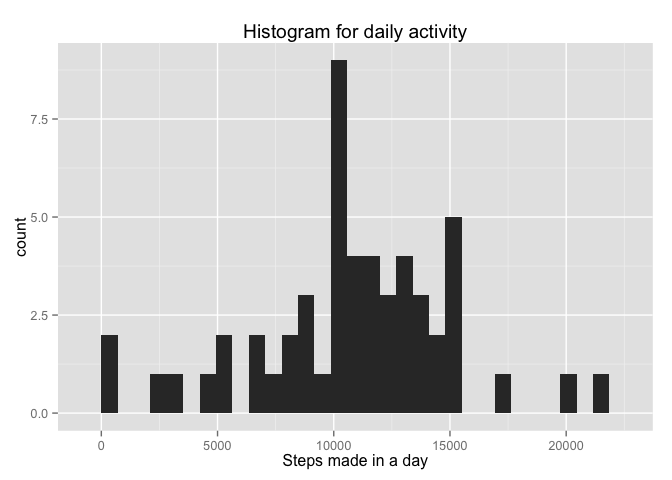
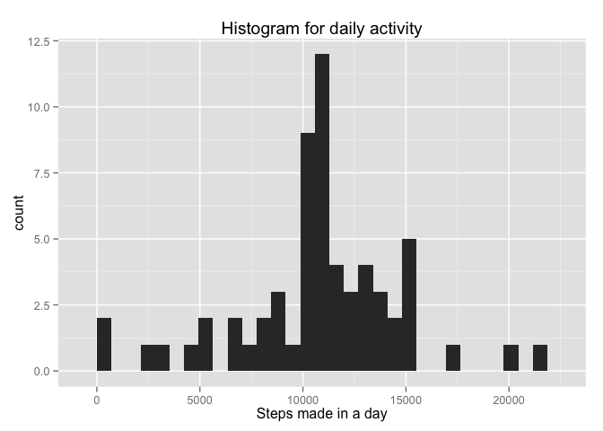
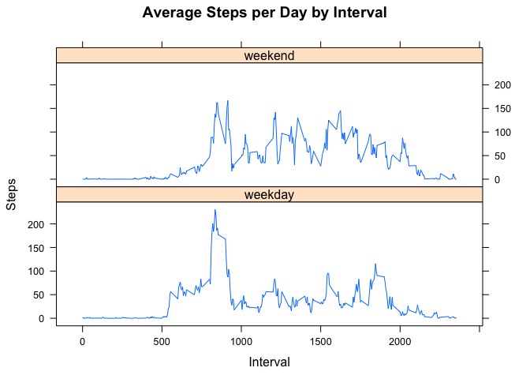

# Reproducible Research: Peer Assessment 1

Elaboration made for the Peer Assessment 1 of the Coursera course "Reproducible Research".

The following libraries are needed for the elaboration.


```r
library(ggplot2)
library(lattice)
```

## Loading and preprocessing the data
First step consist in loading the data from the CSV file provided zipped (the code unzip the file if needed). The imported dataset is saved in the variable activity, and the code provide a summary of it.


```r
# if csv file don't exist unzip the archive 
if(!file.exists('activity.csv')){
    unzip('activity.zip')
}
# import data form csv and save it on the activity data frame
activity <- read.csv('activity.csv')
summary(activity)
```

```
##      steps                date          interval     
##  Min.   :  0.00   2012-10-01:  288   Min.   :   0.0  
##  1st Qu.:  0.00   2012-10-02:  288   1st Qu.: 588.8  
##  Median :  0.00   2012-10-03:  288   Median :1177.5  
##  Mean   : 37.38   2012-10-04:  288   Mean   :1177.5  
##  3rd Qu.: 12.00   2012-10-05:  288   3rd Qu.:1766.2  
##  Max.   :806.00   2012-10-06:  288   Max.   :2355.0  
##  NA's   :2304     (Other)   :15840
```

Activity is a  data.frame structure containing 17568 observation of 3 variables.

## What is mean total number of steps taken per day?
Aggregate (sum) the steps numbers in the same date and save it in the activity_per_day variable.


```r
activity_per_day <- aggregate(steps ~ date, data = activity, FUN = sum)
```

Activity_per_day is a  data.frame structure containing 53 observation of 2 variables.

Then we can make an histogram on steps made in a day  based on Activity_per_day dataset.


```r
qplot(activity_per_day$steps, geom="histogram",  main = "Histogram for daily activity",  xlab = "Steps made in a day")
```

 

And calculate mean and median values.


```r
activity_per_day_mean <- mean(activity_per_day$steps)
activity_per_day_median <- median(activity_per_day$steps)
```

The mean of steps per day  is 1.0766189\times 10^{4}; the median of steps per day is 10765.

## What is the average daily activity pattern?
Aggregate steps using the 5-minute interval and calculate the average steps taken (mean) across all days, save it in the activity_per_interval variable. Then plot the data in a chart.


```r
activity_per_interval <- aggregate(steps ~ interval, data = activity, FUN = mean)
plot(activity_per_interval, type = "l")
```

 

Activity_per_interval is a  data.frame structure containing 288 observation of 2 variables.

The interval with maximum number of steps can easily found with a simple selection filter.


```r
activity_per_interval$interval[which.max(activity_per_interval$steps)]
```

```
## [1] 835
```

## Imputing missing values
The dataset contain a number of NA values (missing values), this number can be found with the following code.


```r
sum(is.na(activity$step))
```

```
## [1] 2304
```

A good and easy replace for this NA values can be the mean value like calculated in the activity_per_interval dataset. A new dataset called activity_corrected is obtained merging the mean value column to the activity dataset, the assigning to all the NA values the value of the mean column.


```r
# add the mean column (merged based on interval value)
activity_corrected <- merge(activity, activity_per_interval, by = "interval")
colnames(activity_corrected) <- c("interval","steps","date","mean")
# substitute every NA with mean value
activity_corrected$steps[is.na(activity_corrected$steps)] <- activity_corrected$mean[is.na(activity_corrected$steps)]
# remove mean 
activity_corrected <- activity_corrected[ , c(1:3)]
```

Aggregate (sum) the steps numbers in the same date from the activity_corrected structure  and save it in the activity_per_day_corrected variable.


```r
activity_per_day_corrected <- aggregate(steps ~ date, data = activity_corrected, FUN = sum)
```

Activity_per_day_corrected  is a  data.frame structure containing 61 observation of 2 variables.

Then make an histogram on steps made in a day  based on Activity_per_day_corrected dataset.


```r
qplot(activity_per_day_corrected$steps, geom="histogram", main = "Histogram for daily activity",  xlab = "Steps made in a day")
```

 

And calculate mean and median values.


```r
activity_per_day_corrected_mean <- mean(activity_per_day_corrected$steps)
activity_per_day_corrected_median <- median(activity_per_day_corrected$steps)
```

The mean of steps per day after correction  is 1.0766189\times 10^{4} with a difference of 0 steps (equal to 0%).
The median of steps per day after correction  is 1.0766189\times 10^{4} with a difference of 1.1886792 steps (equal to 0.0110421%).

The histogram after correction is different in absolute values showing a higher count, the shape is around the same in both histograms.

## Are there differences in activity patterns between weekdays and weekends?
For this part the weekdays() function may be of some help here. Use the dataset with the filled-in missing values for this part.

Create a new factor variable in the dataset with two levels "weekday" and "weekend" indicating whether a given date is a weekday or weekend day; it means apply a function that classify every record made in saturday or sunday like a weekend record. Remember to convert it in factors at the end (useful for future elaboration and print).


```r
daykind <- function(date) {
    if (weekdays(as.Date(date)) %in% c("Saturday", "Sunday")) {
        "weekend"
    } else {
        "weekday"
    }
}

activity_corrected$daykind <- as.factor(sapply(activity_corrected$date, daykind))
```

After corrections we can aggregate (calculate mean) steps by interval and daykind (weekday or weekend).


```r
activity_per_interval_corrected <- aggregate(steps ~ interval+daykind, data = activity_corrected, FUN = mean)
```

activity_per_interval_corrected  is a  data.frame structure containing 576 observation of 3 variables.

Then print the comparison chart between weekend and weekdays activity.


```r
xyplot(activity_per_interval_corrected$steps ~ activity_per_interval_corrected$interval|activity_per_interval_corrected$daykind, main="Average Steps per Day by Interval", xlab = "Interval", ylab = "Steps", layout = c(1,2), type="l")
```

 
